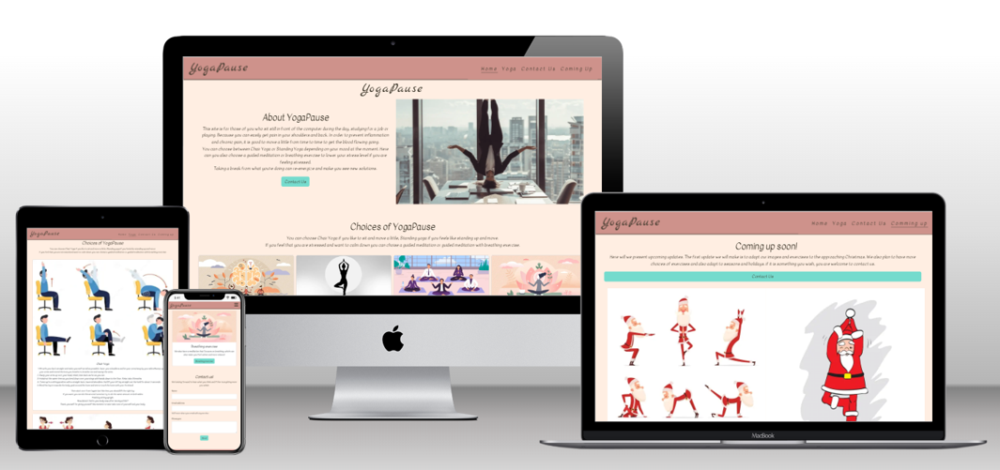
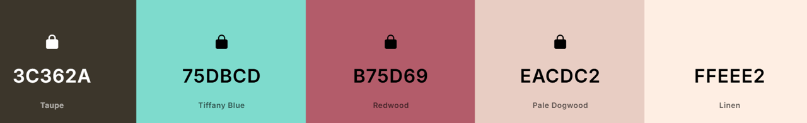
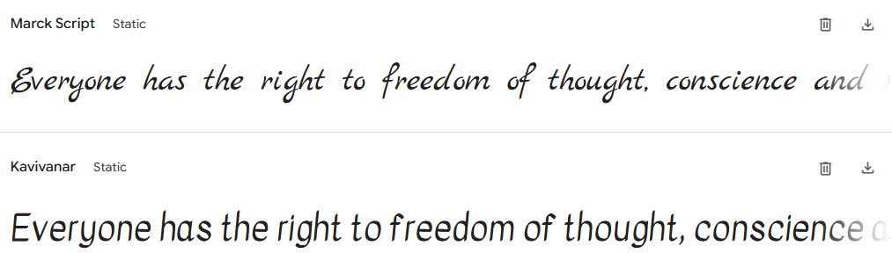

# YogaPause

The Yoga pause web site is build for everyone that sits infront of the desk for many hours and needs to take a small break and move or relax for a moment. I did this due to that I have seen in my previous job that many got pain in nack, shoulders caused of to many hours infront of the computer. As I am a Yoga teatcher I thought that wolud be good for the healht to take a small paus and do yoga or relax with help of meditation.

[View YogaPaus on Github Pages](https://annikaw-dev.github.io/YogaPause)

If you want to add optional [shields.io](https://shields.io) badges to your README, I like to add them to this section.

---

## CONTENTS

* [User Experience](#user-experience-ux)
  * [User Stories](#user-stories)

* [Design](#design)
  * [Colour Scheme](#colour-scheme)
  * [Typography](#typography)
  * [Imagery](#imagery)
  * [Wireframes](#wireframes)

* [Features](#features)
  * [General Features on Each Page](#general-features-on-each-page)
  * [Future Implementations](#future-implementations)
  * [Accessibility](#accessibility)

* [Technologies Used](#technologies-used)
  * [Languages Used](#languages-used)
  * [Frameworks, Libraries & Programs Used](#frameworks-libraries--programs-used)

* [Deployment & Local Development](#deployment--local-development)
  * [Deployment](#deployment)
  * [Local Development](#local-development)
    * [How to Fork](#how-to-fork)
    * [How to Clone](#how-to-clone)

* [Testing](#testing)

* [Credits](#credits)
  * [Code Used](#code-used)
  * [Content](#content)
  * [Media](#media)
  * [Acknowledgments](#acknowledgments)

---

## User Experience (UX)

### Initial Discussion
The Yoga pause web site is build for everyone that sits infront of the desk for many hours and needs to take a small break and move or relax for a moment. I did this due to that I have seen in my previous job that many got pain in nack, shoulders caused of to many hours infront of the computer. As I am a Yoga teatcher I thought that wolud be good for the health to take a small paus and do yoga or relax with help of meditation.

This is a start up site that the owner want to grow but wanted to start small to let it grow after the visitors feedback.

### User Stories

#### Yoga beginners
Would like to receive step-by-step instructions for beginner yoga.
Would like clear images that showing each position.
Would like easy positions that all can do.

#### Workers
Want to have short sessions due they only can take short pauses.
Want sessions that are suitable for small spaces.
Want alternative seated yoga.
Want to have session that helps to be more calm and relaxed.

## Design

👩🏻‍💻 View an example of a completed design section [here](https://github.com/kera-cudmore/earth-day-hackathon-2022#Design)

### Colour Scheme

I choosed those colurs due to that i like them and I think those colours are calming and soft to look at. The blue colour did I chose due to that i thought it was goo with the other but pops so I used that to all buttons.

I got to change the colour a little due to low contrast LÄNK TILL test

### Typography

I choose Marck Script due to that is soft and looks nice in the navbar and as a h1 header.
Choose Kavivnar due to that is allso soft but are much easier to read in longer text. So i used it in all other headers and texts.

### Imagery

I to use the carousel on the home page as a gallery with pictures form office yoga from Stockcake instead of having a gallery https://stockcake.com/.
The images for yoga instructions and for the coming up page I used illustrations from dreamtime  https://www.dreamstime.com/
Both sites have free download and are royaltyfree.

### Wireframes

Wireframes were created for mobile, tablet, and desktop

[Shows the wireframes for home page](docs/readme_images/wireframe_home.png)

[Shows the wireframes for yoga page](docs/readme_images/wireframe_yoga.png)

[Shows the wireframes for gallery page](docs/readme_images/wireframe_yoga.png)

## Features

YogaPaus is divided in three pages as home, Yoga and coming up. It allso have ha thank you page that is shown when the user have sent a message and a 404 page.

* All pages have: 

  * A navigation bar that are responsive and easy to use on all size of devices. To the left it has a Header and to the rigth there is hamburger icon that symbolize menu on small devices. when you click it the menu opens up with links to Home, Yoga, Contact Us and Coming Up. On bigger devices the link-menu shows in right section of the nav bar.
  This make it easy for user to navigat on the site from all pages. And the hamburger icon is a well known icon for menu so most user will know what it is used for.

  * A footer with social media icons to facebook, Instagram, x and yotube. This icons that are used as links is universally recognisable and make the footer look clean.  

### General features on each page
 
 * Home page 
  
  * It starts with a About text that describes for whom and what it is good for. It allso describe what the site contains and wht you can expect.

  * Carousel with photos of office worker doing yoga in the office.

  * Card section  with four card that describe the four different sessions you can choose from. they also have a button that takes the use directlly to the yoga page and the choise of session the user choosed.

  * Contact section with a form that contains field for name, email address and a textarea for the messages. All fields requiers to be filled before the user are able to send and the email area will only take email addreses. If the user miss somthing they will get antooltip with information of whts missing.

* Yoga page

 * It starts with a short discription of the content of the page.

  *Card section with four cards.

   * The two fist cards two different yoga sessions one with chair yoga for those that want to sit down and one for those who wnats to stand during the session. on the cards in the top there is an illustration of the positions the session contains and under you can find a step by step discription of the movment and positions.

  * The two last cards contains tow different guided meditation from spotify.

* Comming up page

 * Starts with a description of what we want have in the future that now is a christmas them. We also ask for wishes and feedback from the users and a button whit a link to the contact form.

 * Galley section with images with christmas and yoga them the user can see, among other things Santa Claus do Yoga and meditate.

* Thank you page
 
 * The thank you page will apper when the user send a messages. It says thank you and have an back to home button for easy get back.

* 404 page
 
 * It will apper if there is some thing wrong with a page so the broser cant open it. It contians a cant find the page message and a Back to home button for easy get back.

I then like to add a screenshot of each page of the site here, i use [amiresponsive](https://ui.dev/amiresponsive) which allows me to grab an image of the site as it would be displayed on mobile, tablet and desktop, this helps to show the responsiveness of the site.

### Future Implementations

* In the feature ia would like to:

  *add login so the members have access to: 

   * have holliday thems for every holliday so yo can chose if you want to use the theme.

   * I would also like to have recorded instuction that so the user can chose to listen or read the instuction and more different sessisions.

### Accessibility

Be an amazing developer and get used to thinking about accessibility in all of your projects!

This is the place to make a note of anything you have done with accessibility in mind. Some examples include:

Have you used icons and added aria-labels to enable screen readers to understand these?
Have you ensured your site meets the minimum contrast requirements?
Have you chosen fonts that are dyslexia/accessible friendly?

Code Institute have an amazing channel for all things accessibility (a11y-accessibility) I would highly recommend joining this channel as it contains a wealth of information about accessibility and what we can do as developers to be more inclusive.

## Technologies Used

👩🏻‍💻 View an example of a completed Technologies Used section [here](https://github.com/kera-cudmore/Bully-Book-Club#Technologies-Used)

### Languages Used

Make a note here of all the languages used in creating your project. For the first project this will most likely just be HTML & CSS.

### Frameworks, Libraries & Programs Used

Add any frameworks, libraries or programs used while creating your project.

Make sure to include things like git, GitHub, the program used to make your wireframes, any programs used to compress your images, did you use a CSS framework like Bootstrap? If so add it here (add the version used).

A great tip for this section is to include them as you use them, that way you won't forget what you ended up using when you get to the end of your project.

## Deployment & Local Development

👩🏻‍💻 View an example of a completed Deployment & Local Development section [here](https://github.com/kera-cudmore/TheQuizArms#Deployment)

### Deployment

Include instructions here on how to deploy your project. For your first project you will most likely be using GitHub Pages.

### Local Development

The local development section gives instructions on how someone else could make a copy of your project to play with on their local machine. This section will get more complex in the later projects, and can be a great reference to yourself if you forget how to do this.

#### How to Fork

Place instructions on how to fork your project here.

#### How to Clone

Place instructions on how to clone your project here.

## Testing

Start as you mean to go on - and get used to writing a TESTING.md file from the very first project!

Testing requirements aren't massive for your first project, however if you start using a TESTING.md file from your first project you will thank yourself later when completing your later projects, which will contain much more information.
  
Use this part of the README to link to your TESTING.md file - you can view the example TESTING.md file [here](milestone1-testing.md)

## Credits

👩🏻‍💻 View an example of a completed Credits section [here](https://github.com/kera-cudmore/BookWorm#Credits)

The Credits section is where you can credit all the people and sources you used throughout your project.

### Code Used

If you have used some code in your project that you didn't write, this is the place to make note of it. Credit the author of the code and if possible a link to where you found the code. You could also add in a brief description of what the code does, or what you are using it for here.

### Content

Who wrote the content for the website? Was it yourself - or have you made the site for someone and they specified what the site was to say? This is the best place to put this information.

###  Media

If you have used any media on your site (images, audio, video etc) you can credit them here. I like to link back to the source where I found the media, and include where on the site the image is used.
  
###  Acknowledgments

If someone helped you out during your project, you can acknowledge them here! For example someone may have taken the time to help you on slack with a problem. Pop a little thank you here with a note of what they helped you with (I like to try and link back to their GitHub or Linked In account too). This is also a great place to thank your mentor and tutor support if you used them.